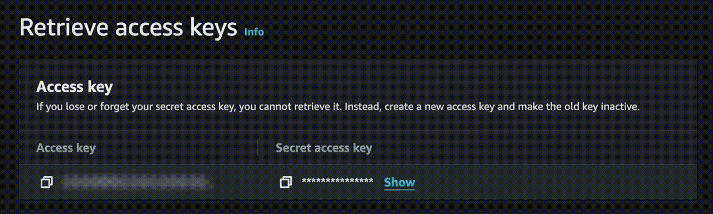

<h1 align="center">

AWS Masking
</h1>

Enhance your security by auto-hiding sensitive information on AWS Management Console.

# Installation

Add to your browser from Chrome Web Store.

- [AWS Masking](https://chromewebstore.google.com/detail/aws-masking/nblpfncgdloilgeicnnlihegobmhjifb)

# LICENSE

[MIT](../LICENSE)
